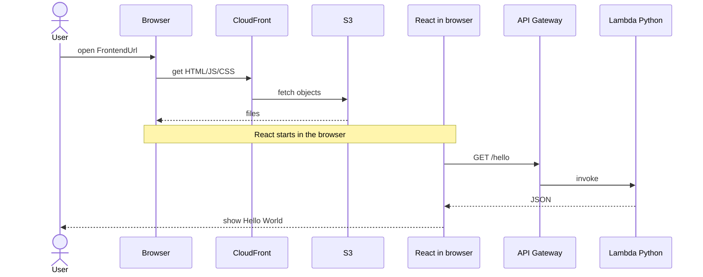

# wizway-hello-aws

ウィズウェイ実績づくり向けのサンプル。  
**React + Python Lambda + API Gateway (HTTP API)** の Hello World。

待機中の実績づくりで、「要件 → 実装 → AWS デプロイ」の型を見せるための最小構成。

## 構成

```
backend/          Python Lambda (GET /hello → {"message":"Hello World"})
frontend/         React (Vite) — ブラウザ上で動き、API を呼ぶ
template.yaml     SAM (HTTP API + S3 + CloudFront)
samconfig.toml    デプロイ設定 (ap-northeast-1 / stack: wizway-hello-aws)
.cursor/mcp.json  AWS Serverless MCP (profile=deploy)
docs/             構成図
```

### 構成図


読み方:

- 左（CloudFront → S3）＝画面ファイルの配信。S3 は置き場だけで API は呼ばない
- 右（API Gateway → Lambda）＝ブラウザ上の React が呼ぶ API
- どちらの矢印も出発点は **Browser（React runs here）**

### 動きの順番

1. ブラウザが CloudFront → S3 から HTML/JS/CSS（ビルド済み React）を取得する  
2. **ブラウザの中で React が起動する**（React は Lambda では動かない）  
3. React が `fetch` で API Gateway の `/hello` を呼ぶ  
4. API Gateway が Lambda（Python）を起動し、JSON が React に返る  
5. React が画面に `Hello World` を出す  

「ブラウザが API を呼んで React に渡す」ではなく、**ブラウザ上の React が API を呼ぶ**。



## 前提

- AWS CLI / SAM CLI / Node.js / uv
- IAM Identity Center の `deploy` profile（Deployer 権限）

```powershell
aws sso login --profile deploy
aws sts get-caller-identity --profile deploy
```

## デプロイ手順

### 1. API + 基盤

```powershell
sam build
sam deploy --profile deploy
```

Outputs から控えるもの:

- `ApiUrl` / `HelloEndpoint`
- `FrontendBucketName`
- `FrontendUrl`
- `CloudFrontDistributionId`

### 2. フロント build & アップロード

`frontend/.env.production` を作成:

```env
VITE_API_URL=https://xxxx.execute-api.ap-northeast-1.amazonaws.com/prod
```

```powershell
cd frontend
npm ci
npm run build
aws s3 sync dist/ s3://<FrontendBucketName>/ --delete --profile deploy
aws cloudfront create-invalidation --distribution-id <CloudFrontDistributionId> --paths "/*" --profile deploy
```

ブラウザで `FrontendUrl` を開き、`Hello World` が出れば成功。

## Cursor Agents + MCP

Serverless MCP を使い、`deploy_webapp` は使わない。

```text
Serverless MCP を使え。deploy_webapp は使うな。
template.yaml を正本にして:
1. sam_build
2. sam_deploy（既存 stack があれば更新）
最後に ApiUrl / FrontendBucketName / FrontendUrl を返せ。
勝手に新サービスを足すな。
```

フロント同期は上記 `aws s3 sync` を続けて実行。

## ローカル確認（クラウドより先に）

Docker Desktop を起動したうえで進める。

### API

```powershell
sam build
sam local start-api
```

別ターミナル:

```powershell
curl http://127.0.0.1:3000/hello
```

`{"message":"Hello World",...}` が返れば OK。

### フロントもつなぐ

`sam local` を動かしたまま:

```powershell
cd frontend
npm ci
```

`frontend/.env.local`:

```env
VITE_API_URL=http://127.0.0.1:3000
```

```powershell
npm run dev
```

ブラウザで表示された URL を開き、`Hello World` が出ることと、開発者ツールの Network で `/hello` が通ることを確認する。

ローカルとクラウドの対応:

| 手元 | クラウド |
|------|----------|
| `npm run dev` | CloudFront URL |
| `sam local` の `/hello` | API Gateway の `/hello` |

## 関連

- 学習パック: https://github.com/Kazuyuki-Hongo/ai-utilization-pack （`3.実績づくり向け/04`）
