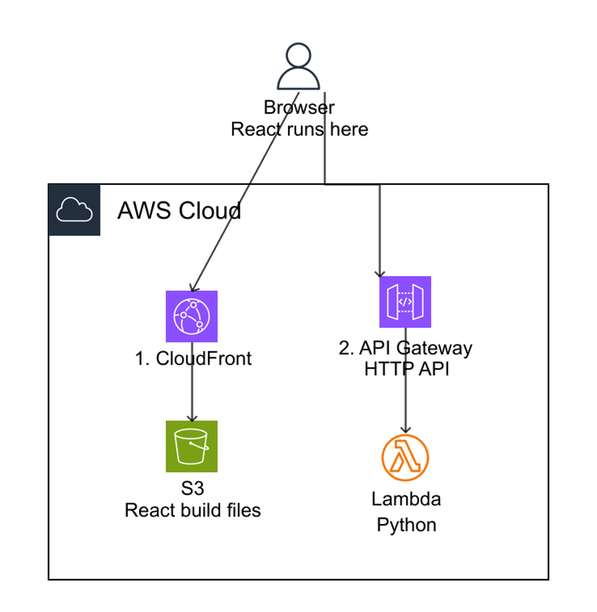

# wizway-hello-aws

ウィズウェイ実績づくり向けのサンプル。  
お題は雑でよい、の実例として **「雑メモボード」** を載せている。

**React + Python Lambda + API Gateway (HTTP API) + DynamoDB**

| 経路 | 役割 |
|------|------|
| `GET /hello` | 疎通確認（永続化なし） |
| `GET/POST /items` | メモ一覧・追加（DynamoDB） |
| `DELETE /items/{id}` | メモ削除（DynamoDB） |

追加したメモは再読み込み後も残る。これが DynamoDB を入れる理由。

## 動いている画面（デプロイ済み）

- フロント: https://d25bl1xmuu0yux.cloudfront.net
- API（items）: https://3k3bug5qo8.execute-api.ap-northeast-1.amazonaws.com/prod/items
- API（hello）: https://3k3bug5qo8.execute-api.ap-northeast-1.amazonaws.com/prod/hello

実績づくり用サンドボックス。中身は架空メモのみ。

## 構成

```
backend/          Python Lambda (/hello, /items)
frontend/         React (Vite) — Hello 表示 + Items 一覧/追加
template.yaml     SAM (HTTP API + DynamoDB + S3 + CloudFront)
samconfig.toml    デプロイ設定 (ap-northeast-1 / stack: wizway-hello-aws)
.cursor/mcp.json  AWS Serverless MCP (profile=deploy)
docs/             構成図
```

### 構成図



読み方（図は Hello 中心。データは図の右に DynamoDB が付くイメージ）:

- 左（CloudFront → S3）＝画面ファイルの配信。S3 は置き場だけで API は呼ばない
- 右（API Gateway → Lambda）＝ブラウザ上の React が呼ぶ API
- **残るデータ**は Lambda → **DynamoDB**（`/items`）。Lambda のメモリには残らない
- どちらの矢印も出発点は **Browser（React runs here）**

### 動きの順番

1. ブラウザが CloudFront → S3 から HTML/JS/CSS（ビルド済み React）を取得する  
2. **ブラウザの中で React が起動する**（React は Lambda では動かない）  
3. React が `fetch` で API Gateway の `/hello` や `/items` を呼ぶ  
4. API Gateway が Lambda（Python）を起動する  
5. `/items` は DynamoDB を読み書きし、JSON が React に返る  

「ブラウザが API を呼んで React に渡す」ではなく、**ブラウザ上の React が API を呼ぶ**。

## 前提

- AWS CLI / SAM CLI / Node.js / uv
- IAM Identity Center の `deploy` profile（Deployer 権限。DynamoDB 含む）

```powershell
aws sso login --profile deploy
aws sts get-caller-identity --profile deploy
```

## デプロイ手順

### 1. API + 基盤

```powershell
sam build
sam deploy --profile deploy
```

Outputs から控えるもの:

- `ApiUrl` / `HelloEndpoint` / `ItemsEndpoint`
- `ItemsTableName`
- `FrontendBucketName`
- `FrontendUrl`
- `CloudFrontDistributionId`

### 2. フロント build & アップロード

`frontend/.env.production` を作成:

```env
VITE_API_URL=https://xxxx.execute-api.ap-northeast-1.amazonaws.com/prod
```

```powershell
cd frontend
npm ci
npm run build
aws s3 sync dist/ s3://<FrontendBucketName>/ --delete --profile deploy
aws cloudfront create-invalidation --distribution-id <CloudFrontDistributionId> --paths "/*" --profile deploy
```

ブラウザで `FrontendUrl` を開き、`Hello World` と Items の追加・一覧ができれば成功。  
コンソール（ポータル → Deployer）で DynamoDB の表に項目があることも見る。

## Cursor Agents + MCP

Serverless MCP を使い、`deploy_webapp` は使わない。

```text
Serverless MCP を使え。deploy_webapp は使うな。
template.yaml をいちばん正しい設計図にして:
1. sam_build
2. sam_deploy（既存 stack があれば更新）
最後に ApiUrl / ItemsEndpoint / FrontendBucketName / FrontendUrl を返せ。
勝手に新サービスを足すな（永続化は DynamoDB のまま）。
```

フロント同期は上記 `aws s3 sync` を続けて実行。

## ローカル確認（クラウドより先に）

Docker Desktop を起動したうえで進める（`sam local` がコンテナで Lambda 相当を動かすため）。

Windows の導入例:

```powershell
winget install -e --id Docker.DockerDesktop
```

参考: https://docs.docker.com/desktop/setup/install/windows-install/  
学習パックの手順: https://github.com/Kazuyuki-Hongo/ai-utilization-pack （`3.実績づくり向け/04` §5.2）

### API

```powershell
sam build
sam local start-api
```

別ターミナル:

```powershell
curl http://127.0.0.1:3000/hello
Invoke-RestMethod -Method Post -Uri http://127.0.0.1:3000/items -ContentType "application/json" -Body '{"title":"牛乳買う"}'
Invoke-RestMethod http://127.0.0.1:3000/items
# 削除例: Invoke-RestMethod -Method Delete -Uri http://127.0.0.1:3000/items/<id>
```

`sam local` 時の `/items` は **メモリ上の仮データ**（学習用）。クラウドでは DynamoDB に残る。

### フロントもつなぐ

`sam local` を動かしたまま:

```powershell
cd frontend
npm ci
```

`frontend/.env.local`:

```env
VITE_API_URL=http://127.0.0.1:3000
```

```powershell
npm run dev
```

ブラウザで Hello と Items が動くことを確認する。

ローカルとクラウドの対応:

| 手元 | クラウド |
|------|----------|
| `npm run dev` | CloudFront URL |
| `sam local` の `/hello` | API Gateway の `/hello` |
| `sam local` の `/items`（メモリ） | API Gateway の `/items` → DynamoDB |

## 関連

- 学習パック（構成）: https://github.com/Kazuyuki-Hongo/ai-utilization-pack （`3.実績づくり向け/04`）
- 学習パック（DynamoDB）: 同リポジトリ `3.実績づくり向け/06.データを残す_DynamoDB.md`
